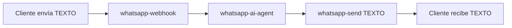
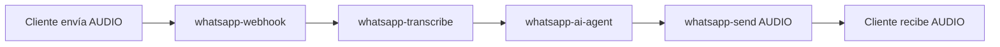

# 🚀 Sistema WhatsApp + IA con Respuestas Inteligentes

## 📋 Descripción General

Sistema completo que permite a los vendedores de Toogo recibir mensajes por WhatsApp y obtener respuestas automáticas inteligentes generadas por IA. El sistema detecta automáticamente si el mensaje es texto o audio y responde en el mismo formato.

### ✨ Características Principales

- ✅ **Texto → Texto**: Cliente escribe texto, bot responde con texto
- ✅ **Audio → Audio**: Cliente envía nota de voz, bot responde con nota de voz
- ✅ **Transcripción automática** con OpenAI Whisper
- ✅ **IA conversacional** con Gemini 2.5 Flash via Lovable AI
- ✅ **Herramientas inteligentes**: Consultar productos, actualizar stock, ver pedidos
- ✅ **Logging completo** de todas las interacciones
- ✅ **Dashboard visual** para gestionar conversaciones

---

## 🏗️ Arquitectura del Sistema

### 📊 Base de Datos (4 tablas)

```sql
whatsapp_users          # Vendedores registrados
whatsapp_conversations  # Conversaciones activas
whatsapp_messages       # Historial de mensajes
whatsapp_logs          # Logs de eventos
```

### ⚙️ Edge Functions (4 funciones)

```typescript
whatsapp-webhook       // Recibe webhooks de Meta (público)
whatsapp-transcribe    // Transcribe audio a texto (interno)
whatsapp-ai-agent      // Procesa mensajes con IA (interno)
whatsapp-send          // Envía respuestas (interno)
```

### 🔐 Secrets Configurados

- ✅ `META_WHATSAPP_TOKEN` - Token de acceso de WhatsApp Business API
- ✅ `META_PHONE_NUMBER_ID` - ID del número de WhatsApp
- ✅ `META_VERIFY_TOKEN` - Token de verificación del webhook
- ✅ `OPENAI_API_KEY` - Para transcripción (Whisper) y TTS
- ✅ `LOVABLE_API_KEY` - Para IA conversacional (Gemini)

---

## 📖 Configuración Paso a Paso

### 1️⃣ Prerrequisitos

- Cuenta de [Meta for Developers](https://developers.facebook.com)
- WhatsApp Business API aprobada
- Número de teléfono verificado en Meta

### 2️⃣ Configurar Webhook en Meta

1. Ve a [Meta for Developers](https://developers.facebook.com)
2. Selecciona tu aplicación de WhatsApp Business
3. En el menú lateral, ve a **WhatsApp → Configuration**
4. En la sección **Webhook**:
   - **Callback URL**: Copia desde el dashboard de Toogo (Admin → WhatsApp)
   - **Verify Token**: Usa el valor que configuraste en `META_VERIFY_TOKEN`
5. Haz clic en **Verify and Save**
6. En **Webhook Fields**, suscríbete a:
   - ✅ `messages`
   - ✅ `message_status` (opcional)

### 3️⃣ Registrar Número de WhatsApp

1. Inicia sesión como **Superadmin** en Toogo
2. Ve a **Admin → WhatsApp**
3. Ingresa tu número de WhatsApp Business (formato: `+521234567890`)
4. Haz clic en **Registrar**
5. Copia la **Webhook URL** y configúrala en Meta (paso anterior)

### 4️⃣ Verificar Configuración

1. Envía un mensaje de prueba desde otro número al WhatsApp Business
2. Ve a **Admin → WhatsApp → Conversaciones**
3. Deberías ver:
   - ✅ Mensaje entrante
   - ✅ Respuesta automática del bot
   - ✅ Logs de transcripción (si enviaste audio)

---

## 🎯 Flujo de Funcionamiento

### Mensaje de Texto



### Mensaje de Audio



---

## 🤖 Capacidades del Bot de IA

El bot tiene acceso a las siguientes herramientas:

### 📊 `get_store_stats`
Obtiene estadísticas generales de la tienda:
- Total de productos
- Total de pedidos
- Ingresos totales

**Ejemplo de uso**: *"¿Cuántos productos tengo en total?"*

### 📦 `list_products`
Lista productos con filtros opcionales:
- Estado (activo/inactivo)
- Límite de resultados

**Ejemplo de uso**: *"Muéstrame los productos activos"*

### ✏️ `update_product`
Actualiza precio, stock o estado de un producto:
- Cambiar precio
- Actualizar stock
- Activar/desactivar

**Ejemplo de uso**: *"Actualiza el precio del producto X a $500"*

### 📋 `list_orders`
Lista pedidos recientes con filtros:
- Estado (pending, paid, shipped, etc.)
- Límite de resultados

**Ejemplo de uso**: *"Muéstrame los últimos 5 pedidos"*

### 🔄 `update_order_status`
Cambia el estado de un pedido:
- pending → paid
- paid → shipped
- shipped → delivered

**Ejemplo de uso**: *"Marca el pedido ABC como enviado"*

---

## 📊 Dashboard de Gestión

### Pestaña: Configuración
- Ver/editar número de WhatsApp registrado
- Copiar Webhook URL para Meta
- Estado de activación

### Pestaña: Conversaciones
- Lista de conversaciones activas
- Número de cliente
- Estado (activo/cerrado)
- Última actividad

### Pestaña: Mensajes
- Historial completo de mensajes
- Dirección (entrante/saliente)
- Tipo (texto/audio)
- Transcripciones de audio
- Timestamps

---

## 🔍 Debugging y Logs

### Ver Logs en Supabase

```sql
SELECT * FROM whatsapp_logs 
WHERE tenant_id = 'tu-tenant-id' 
ORDER BY created_at DESC 
LIMIT 50;
```

### Tipos de Logs

| `event_type` | Descripción |
|--------------|-------------|
| `webhook_received` | Webhook recibido de Meta |
| `unknown_user` | Número no registrado |
| `audio_transcribed` | Audio transcrito exitosamente |
| `message_processed` | Mensaje procesado completamente |
| `message_sent` | Respuesta enviada exitosamente |

### Ver Logs de Edge Functions

```bash
# En Supabase Dashboard
Edge Functions → whatsapp-webhook → Logs
```

---

## 🛠️ Troubleshooting

### ❌ No recibo mensajes

**Solución**:
1. Verifica que el webhook esté configurado correctamente en Meta
2. Revisa que el `META_VERIFY_TOKEN` sea el mismo en Meta y Supabase
3. Comprueba los logs de `whatsapp-webhook` para errores

### ❌ Bot no responde

**Solución**:
1. Verifica que tu número esté registrado en `whatsapp_users`
2. Comprueba que `is_active = true`
3. Revisa los logs de `whatsapp-ai-agent`

### ❌ Audio no se transcribe

**Solución**:
1. Verifica que `OPENAI_API_KEY` esté configurado
2. Comprueba los logs de `whatsapp-transcribe`
3. Asegúrate de que el formato de audio sea compatible (ogg/opus)

### ❌ No se genera respuesta de audio

**Solución**:
1. Verifica que `OPENAI_API_KEY` esté configurado
2. Comprueba los logs de `whatsapp-send`
3. Revisa que Meta permita subir archivos de audio

---

## 📈 Próximos Pasos

### Mejoras Futuras
- [ ] Soporte para imágenes
- [ ] Respuestas con productos embebidos
- [ ] Análisis de sentimiento
- [ ] Detección de intención de compra
- [ ] Notificaciones push cuando llegan mensajes

### Integraciones Adicionales
- [ ] CRM para gestión de leads
- [ ] Automatización de seguimiento
- [ ] Estadísticas avanzadas de conversación
- [ ] Multi-agente (varios vendedores)

---

## 📞 Soporte

Si tienes problemas con la configuración:

1. Revisa los logs en **Admin → WhatsApp**
2. Consulta la [documentación de WhatsApp Business API](https://developers.facebook.com/docs/whatsapp)
3. Revisa los logs de Supabase Edge Functions

---

## 🎉 ¡Listo!

Tu sistema WhatsApp + IA está completamente configurado y listo para usar. Los clientes pueden enviar mensajes de texto o audio y recibirán respuestas inteligentes en el mismo formato.
